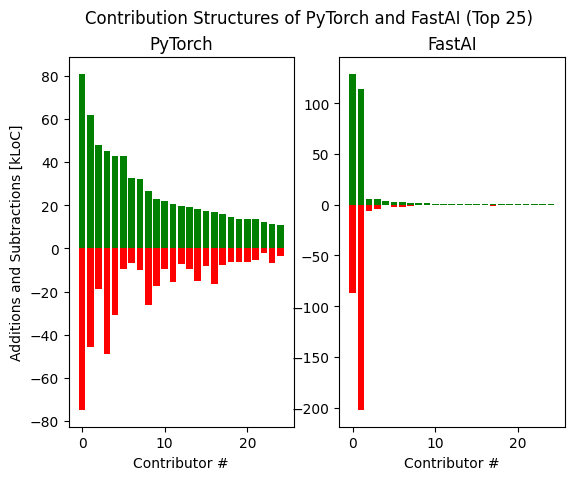

## Contribution Structures of FastAI and PyTorch Libraries, January 2020-April 2021

This repository contains a pair of .csv files and Python script for visualizing the respective contribution structures of the [PyTorch](https://github.com/pytorch/pytorch/graphs/contributors) and [FastAI](https://github.com/fastai/fastai/graphs/contributors) for between appx. January 2020 - April 2021. 



The dependencies can be installed and the script executed by using
```
$ pip3 install polars numpy matplotlib
$ python3 plot_data.py
```